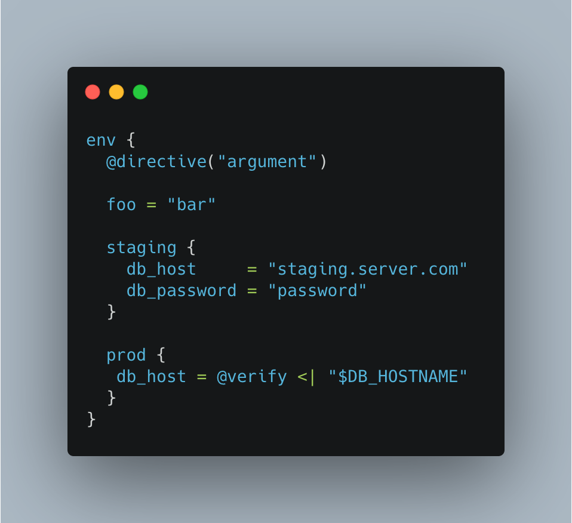

# KyoML

A dynamic markup language with support for directives and plugins

## Roadmap

- [x] Primitive types
- [x] Comments
- [x] Blocks
- [x] Directives
- [x] Pipes
- [ ] VSCode syntax hightlighting
- [ ] Playground
- [ ] CLI converter
